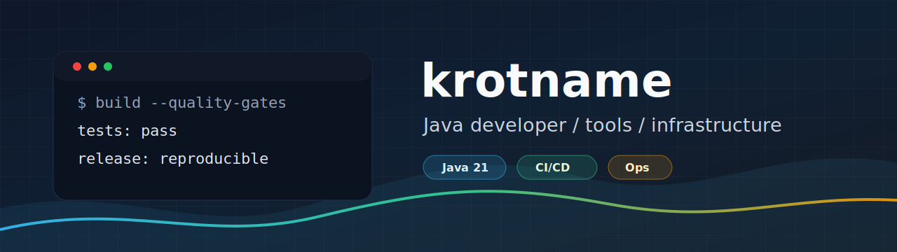
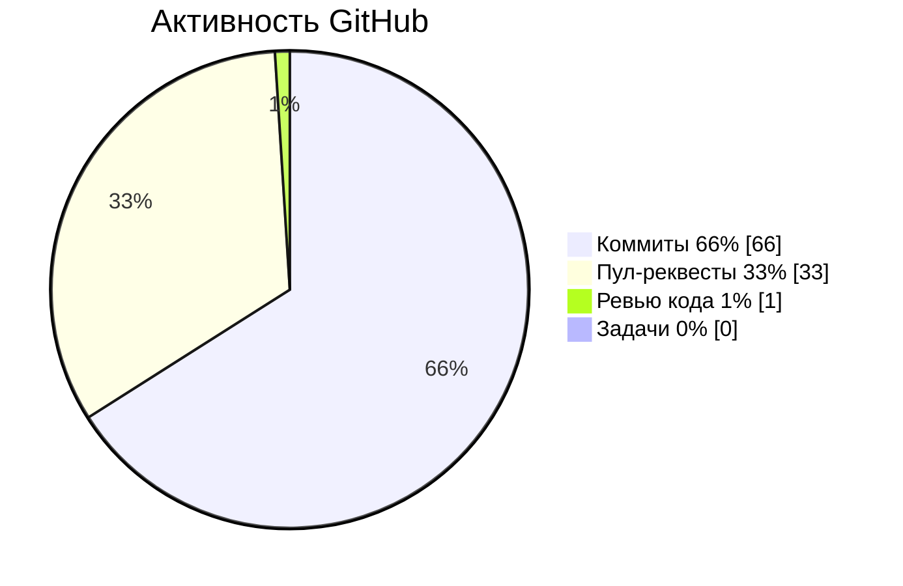

  

[English](README.en.md)

  
  
  

## Фокус

- Java backend и desktop tooling: Spring Boot, Swing, Gradle, Maven.
- Developer tools: редакторы Markdown-таблиц для Notepad++ и JetBrains IDE.
- Автоматизация и инфраструктура: Telegram bots, home AI/video stack, monitoring, deploy scripts.
- Гигиена публичных repo: tests, release assets, checksums, SBOM, pinned GitHub Actions.

## Стек

| Область | Инструменты |
|---|---|
| Языки |     |
| Backend |     |
| Качество |     |

## Избранные проекты

| Проект | Что это |
|---|---|
| [NppMarkdownTableEditor](https://github.com/krotname/NppMarkdownTableEditor) | Notepad++ plugin для редактирования и форматирования Markdown-таблиц с тестами, CI и release builds. |
| [IdeaMarkdownTableEditor](https://github.com/krotname/IdeaMarkdownTableEditor) | JetBrains IDE plugin с общей логикой форматирования Markdown-таблиц и CI. |
| [CompanyStatusChecker](https://github.com/krotname/CompanyStatusChecker) | Java 21 сервис проверки статуса российских компаний через DaData, с OpenAPI, Docker и quality gates. |
| [JavaSoundRecorder](https://github.com/krotname/JavaSoundRecorder) | Swing desktop recorder с Dropbox upload, tests, CI и release artifacts. |
| [JavaNetworkChat](https://github.com/krotname/JavaNetworkChat) | Java 21 TCP-чат с Swing GUI, JSON-протоколом, release bundle и quality gates. |
| [TelegramResenderBot](https://github.com/krotname/TelegramResenderBot) | Telegram bot для whitelist-based routing с Docker runtime, тестами и pinned dependency locks. |
| [HomeFrigateOllamaIaC](https://github.com/krotname/HomeFrigateOllamaIaC) | Hyper-V и Ansible IaC для домашнего Frigate + Ollama GPU video AI stack. |

## GitHub Signals

<!-- ACTIVITY-MIX:START -->
Последние 12 месяцев (2025-07-02 - 2026-07-02), всего вкладов в GitHub: 5424.

<!-- ACTIVITY-MIX:END -->

## Контакты

- Сайт: [krot.name](http://krot.name)
- GitHub: [@krotname](https://github.com/krotname)
